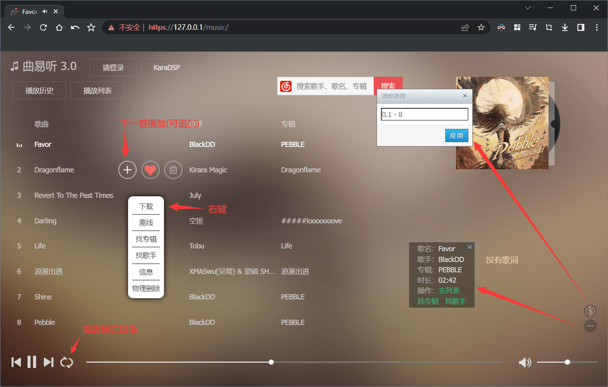
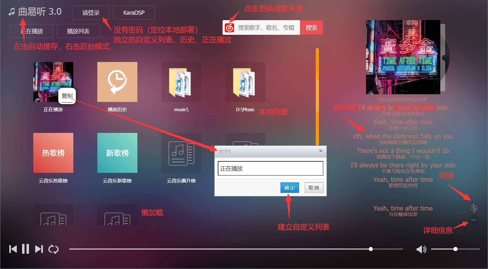
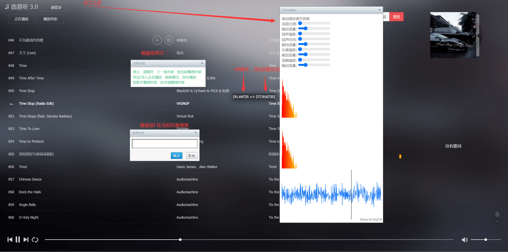
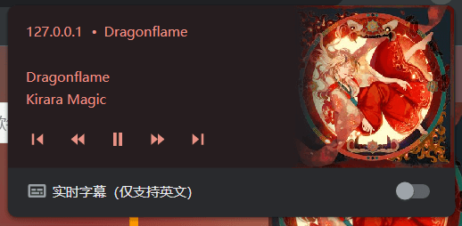
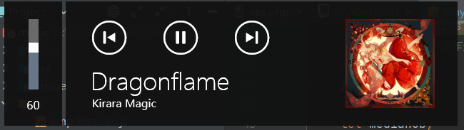
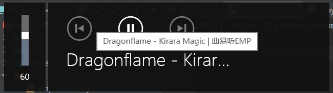

# EasyMusicPlayer (3.1.9)

同样是我练手的东西，最近大概觉得的有点必要发布  
代码写的很烂  
另外还引用了一个忘了github哪里找到的中文转拼音的js

## 安装
`为避免侵权，代码同样没法直接跑（除非你就当本地播放器用）`
 * 一个带PHP的服务器（应该支持到PHP8）
 * clone项目
 * 编辑`js/player.config.example.js`并重命名为`js/player.config.js`
 * 去这里下Meting.php：https://github.com/metowolf/Meting

## UI

### 系统集成（MediaSession API）
  
  
注：chrome 90-100之间的某个版本开始限制了这个功能必须在https网站上用 (好煞笔)  
建议用chrome86 （bushi
  

## 开发

### 插件系统
WIP

### 配置
先直接看JS吧
或者源项目的readme

### 已知bug
 * 控制台有的时候会报'ERR_LENGTH_MISMATCH'
 * 歌曲源的图标（除了网易QQ和酷狗）是乱的